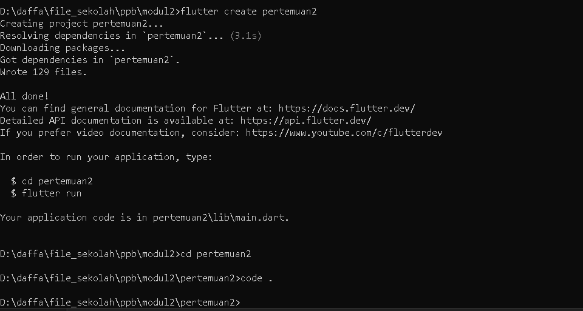
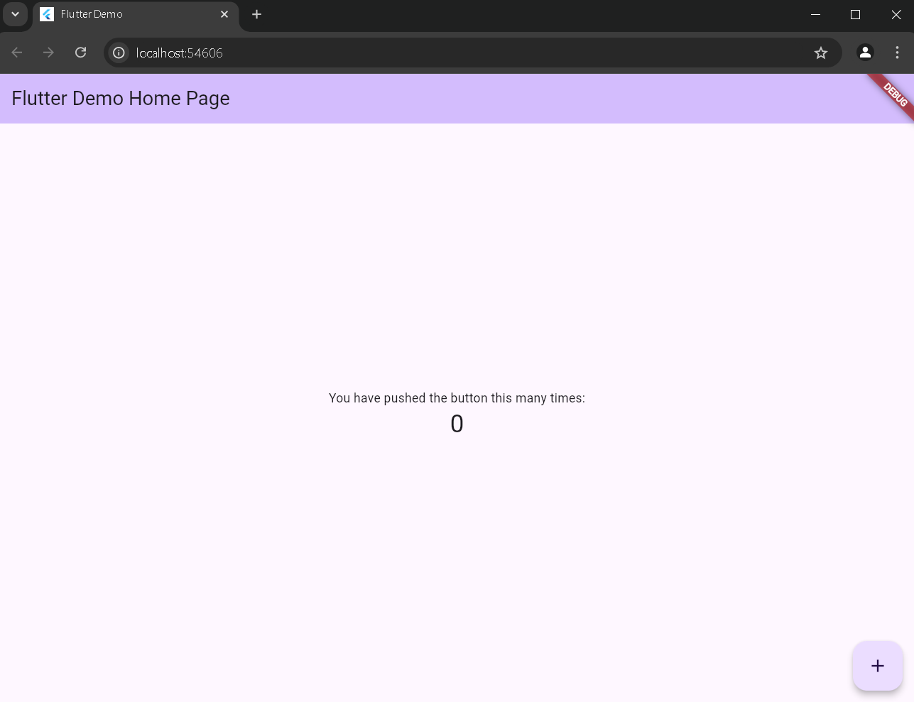
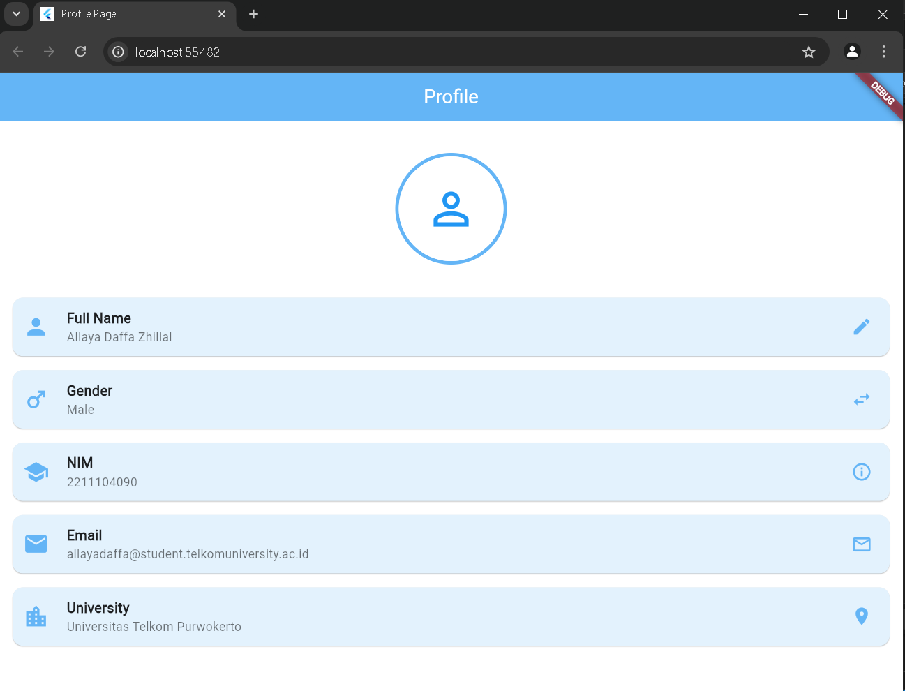

**LAPORAN PRAKTIKUM**  
**PEMOGRAMAN PERANGKAT BERGERAK**  
**MODUL 2**  

Disusun Oleh: 
Allaya Daffa Zhillal 
2211104090 
S1SE-06-02 
 
 

**PRODI S1 REKAYASA PERANGKAT LUNAK**  
**FAKULTAS INFORMATIKA**  
**TELKOM UNIVERSITY PURWOKERTO**  
**2024**  

---

<h1>Tugas Praktikum 2 </h1>

# PPB_Allaya Daffa Zhillal_2211104090_SE-06-C/02_PENGENALAN_FLUTTER/LP_02

<li> Nama   : Allaya Daffa Zhillal
<li> NIM    : 2211104090
<li> Kelas  : SE-06-02

## 1. Jelaskan apa itu Dart & Flutter beserta contoh widget yang ada pada Flutter

<li>Dart adalah bahasa pemrograman yang dikembangkan oleh Google, dirancang untuk sederhana, cepat, dan mudah dipelajari. Ia menggabungkan fitur-fitur terbaik dari JavaScript dan Java.</li>
<li>Flutter adalah framework fleksibel untuk pengembangan aplikasi multi-platform. Dengan performa tinggi dan kemudahan penggunaan, Flutter memungkinkan pengembang membuat antarmuka menarik untuk aplikasi mobile dan web modern.</li>

## Contoh Widget di Flutter
Flutter memiliki banyak sekali jenis widget. Berikut beberapa contoh widget yang sering digunakan:

  <li>StatelessWidget adalah jenis widget dalam Flutter yang tidak memiliki state internal, cocok untuk menampilkan elemen antarmuka pengguna yang statis seperti teks, ikon, dan gambar, serta membantu menciptakan aplikasi yang efisien dan terstruktur dengan baik.</li>
  <li>StatefulWidget adalah jenis widget dalam Flutter yang memiliki state internal dan dapat berubah seiring waktu, sehingga cocok digunakan untuk elemen antarmuka pengguna yang memerlukan interaksi dinamis seperti TextFormField, Checkbox, dan DropdownButton.</li>
  <li>Layout Widget adalah jenis widget dalam Flutter yang digunakan untuk mengatur tata letak elemen di layar, seperti Row, Column, Stack, dan Container.</li>
  <li>Material Widget adalah jenis widget dalam Flutter yang dirancang mengikuti prinsip-prinsip Material Design dari Google, memberikan antarmuka pengguna yang konsisten dan estetis, dengan contoh seperti AppBar yang menyajikan judul aplikasi, Scaffold yang menyediakan struktur dasar untuk layout, dan Card yang digunakan untuk menampilkan konten dalam format yang terpisah dan menarik.</li>
  <li>Cupertino Widget adalah jenis widget dalam Flutter yang dirancang untuk mengikuti gaya dan prinsip desain iOS, sehingga menciptakan pengalaman pengguna yang konsisten dengan aplikasi Apple, dengan contoh seperti CupertinoNavigationBar yang memberikan navigasi intuitif dan CupertinoButton yang menawarkan tombol dengan tampilan khas iOS.</li>

   
  
## 2. Buatlah sebuah project Flutter

 

## 3. Setelah project dibuat, jalankan di emulator atau pada real device (jika pada tampilan telah keluar project Flutter seperti gambar di bawah, maka telah berhasil).

 

## 4. Setelah berhasil, modifikasi halaman diatas untuk menampilkan biodata kalian, minimal 5 widget!! (bebas, buatlah sekreatif mungkin).

